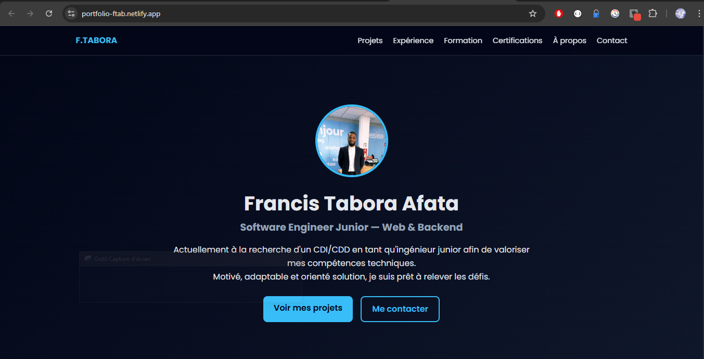

# 🚀 Portfolio — Francis TABORA AFATA

Portfolio personnel développé en HTML5, CSS3 et JavaScript, présentant mon profil, mes projets, mon parcours académique et mes expériences professionnelles.

🔗 **Live** : https://app.netlify.com/teams/stuna123/projects
🔗 **LinkedIn** : https://www.linkedin.com/in/francis-tabora-afata  
🔗 **GitHub** : https://github.com/Stuna123  

---

## 👨‍💻 À propos

Je suis **Software Engineer Junior**, spécialisé en **développement web Frontend & Backend**.  
J’aime concevoir des applications complètes : interface soignée, logique métier robuste et backend sécurisé.

Ce portfolio a pour objectif de présenter :
- mes projets concrets
- ma stack technique
- ma façon de structurer un projet proprement
Screenshot à la fin
---

## 🛠️ Stack technique

## Frontend
- HTML5
- CSS3
- JavaScript (Vanilla)

## Backend (présenté dans les projets)
- Node.js
- Express
- MongoDB / Mongoose
- Authentification JWT & bcrypt

## Outils
- Git & GitHub
- Netlify
- Render

---

## 📂 Projets présentés

## Burger House (Fullstack)
Application de commande en ligne avec :
- interface pour passer la commande 
- authentification sécurisée (JWT & bcrypt)
- panneau admin
- statistiques avec graphique
Stack : __HTML5, CSS3, JavaScript, Node.js, Express, MongoDB__
Repo : https://github.com/Stuna123/burgerRestau-frontend 
Live : https://burgerhouse-ft.netlify.app/
---

## Bookmark App
- Gestion de favoris avec authentification et sauvegarde cloud.
Stack: __Firebase Auth & Storage__  
Repo : https://github.com/Stuna123/bookmark-js
Live : https://bookmark-js-0mw.pages.dev/
---

## Budget Manager
Application de gestion de dépenses avec graphiques.

**Stack** : HTML5, CSS3, JavaScript  
Repo : https://github.com/Stuna123/budgetManager-JS
Live : https://budgetmanager-ft.netlify.app/

## Kanban App
Application de gestion de projet modèle Trello.

**Stack** : HTML5, CSS3, JavaScript 
Repo : https://github.com/Stuna123/kanbanApp-JS
Live : https://kanbanapp-ft.netlify.app/

---

## Screenshot
